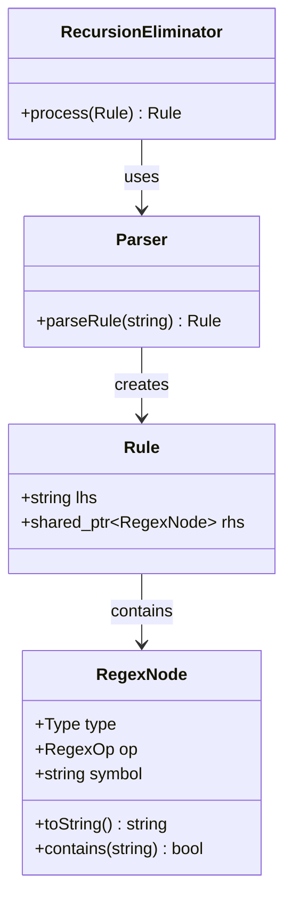

# Устранение рекурсии в CFR-грамматиках (Модуль SynGT)

[![CI Build]

## Описание проекта
Консольная реализация алгоритма эквивалентных преобразований для устранения левой, правой и центральной рекурсии в CFR-грамматиках на языке C++. 
Программа является внешним модулем для системы автоматизированного проектирования языковых процессоров **SynGT**. Выполняет синтаксический анализ регулярных выражений, строит абстрактное синтаксическое дерево (AST) и преобразует рекурсию в итерационные конструкции. Код написан с соблюдением C++ Core Guidelines.

## Ключевые механики
*   **Парсинг правил грамматики** с учетом приоритета операций (объединение `;`, конкатенация `,`, обобщенная итерация `#`, звезда Клини `*`).
*   **Классификация фрагментов правила** на 4 типа ($A_1, A_2, A_3, A_4$).
*   **Эквивалентное преобразование** по математической формуле.
*   **Оптимизация и упрощение** результирующего AST-дерева (удаление пустых множеств `∅`).
*   **Пошаговый вывод** процесса преобразования (Debug output).

## Архитектура проекта (UML)
Архитектура построена на паттерне Композиция.

    Инструкция по сборке
Требования
Компилятор с поддержкой C++14 (GCC 9.0+, MSVC, Clang).
Сборка
Проект состоит из одного файла исходного кода, что не требует использования сложных систем сборки.

Через GCC (Linux/Windows MSYS2):

Bash

git clone
cd RecursionEliminator
g++ main.cpp -o app -Wall -Wextra -O2
./app input.txt
Через Visual Studio (Windows):

Откройте файл .sln (или просто main.cpp).
Убедитесь, что файл input.txt находится в рабочем каталоге.
Нажмите Ctrl + F5.
Использование и Алгоритм
Программа считывает правила из input.txt.
Формат: Нетерминал : Регулярное выражение .

Формула преобразования:
Алгоритм выделяет подвыражения r11, r12, r21, r22 и формирует эквивалентное нерекурсивное правило: 
A:((r21)*, r22, (r12)*)#r11

Лицензия
Проект распространяется под лицензией MIT.

Контакты
GitHub: Vit0GG
Email: st129005@student.spbu.ru
